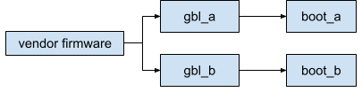
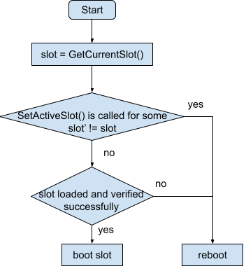

# A/B Boot Flow in GBL

This document explains the A/B boot flows implemented by GBL and its
interaction with EFI protocol
[GBL_EFI_AB_SLOT_PROTOCOL](./gbl_efi_ab_slot_protocol.md).

| **Status**  | Work in progress |
|:------------|-----------------:|
| **Created** |        2025-09-04|

## Android

Both the GBL bootloader and Android OS partitions must be A/B slotted.

Note: The boot flow supports >2 slots. We use A/B simply as an example for
illustration.

### Platform Setup

This configuration corresponds to the following platform setup.

Device has A/B GBL bootloader and A/B Android OS. Vendor firmware makes A/B
slot decision and boots to the correponding GBL slot. GBL simply continues to
boot the same Android OS slot.

### Boot Flow

The boot flow is summarized in the following diagram.

GBL queries the current bootloader slot by calling
[GBL_EFI_AB_SLOT_PROTOCOL.GetCurrentSlot()](./gbl_efi_ab_slot_protocol.md#gbl_efi_ab_slot_protocolgetcurrentslot).
It also tracks whether
[GBL_EFI_AB_SLOT_PROTOCOL.SetActiveSlot()](./gbl_efi_ab_slot_protocol.md#gbl_efi_ab_slot_protocolsetactiveslot)
has been called to change the next active slot to a different slot, i.e. by
`fastboot set_active`. If it has, GBL considers that the user intends to boot
to a different slot than the current one and will trigger a reboot. If not, GBL
proceeds to load and verify the same slot Android OS. If all operations are
successful, GBL boots from it. Otherwise it triggers a reboot. Note that in
this flow, vendor firmware is responsible for updating slot metadata such as
decrementing retry counters before booting GBL.

## Fuchsia

TBD
